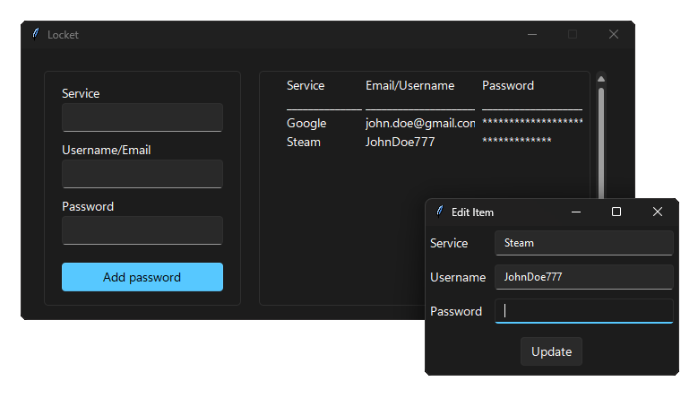

# Locket
<p align="center">
  
</p>


### What is Locket?
Locket is a secure and user-friendly password manager built with Python. It uses AES in GCM (Galois Counter Mode) for encryption, providing both confidentiality and integrity. The encryption key is derived from a user-provided password using PBKDF2 with SHA-256, ensuring strong security.

### Key Features

- **AES in GCM Mode:** Advanced Encryption Standard (AES) in Galois/Counter Mode (GCM) ensures data confidentiality and integrity
- **User-Friendly Interface:** Intuitive and modern UI for easy password management
- **Local Storage:** Data is stored locally on your device, ensuring complete control and privacy
- **Clipboard Integration:** Easily copy usernames and passwords to your clipboard with a single click

### Why use Locket?

- **Security:** Robust encryption and strong key derivation protect your passwords
- **Convenience:** Simple and intuitive interface for efficient password management
- **Privacy:** Local storage ensures your data remains private and secure

### Installation and Usage

1. **Clone the Repository:** 
```bash
git clone https://github.com/Nitaki-dev/Locket.git
cd locket
```
2. **Install Dependencies:**
```bash
pip install -r req.txt
```
3. **Run Locket***
```bash
python main.py
```

### Compiling to an EXE
You can compile Locket to an executable file using PyInstaller:
1. Setup a virtual environment
```bash
python -m venv locket
```
2. Activate the virtual environment
- On windows:
```bash
locket\Scripts\activate.bat
```
- On macOS/Linux:
```bash
source locket/bin/activate
```
3. Install dependencies: (You need to do it again)
```bash
pip install -r req.txt
```
4. Compile Locket:
```
pyinstaller --onefile --collect-data sv_ttk main.py
```
*(You can also add `--noconsole`, but this may trigger a false positive for some antivirus softwares)*

5. Run:
The compiled executable should be located under the `dist` directory.

Locket is licensed under the MIT License.
<br><br>
Libraries used:
<br>
- pycryptodome
- pyperclip
- tkinter
- sv_ttk
